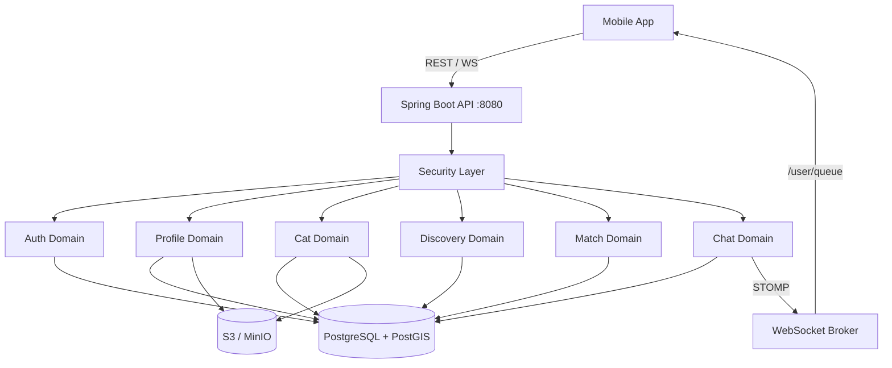

<!-- generated-by: gsd-doc-writer -->
# Architecture

## System Overview

Cat Spell Backend is a Spring Boot 4 monolith written in Kotlin, exposing a REST + WebSocket API. It follows a **domain-sliced package layout** where each business domain (auth, profile, cat, discovery, match, chat) is self-contained with its own controllers, services, models, and repositories. The API serves a mobile dating app for cat lovers — users with cats appear as cat cards in the discovery feed (cat-first reveal), while users without cats appear as human cards.

## Component Diagram



## Data Flow

### REST Request Flow

1. Client sends an HTTP request with a `Bearer` JWT in the `Authorization` header.
2. `RateLimitFilter` runs first (highest precedence) — applies Bucket4j rate limiting to `/api/auth/*` endpoints only (10 requests/minute per IP).
3. `JwtAuthenticationFilter` validates the JWT and sets the `SecurityContext` principal to the user's UUID.
4. Spring Security checks route authorisation — public endpoints: `/api/auth/register`, `/api/auth/login`, `/api/auth/refresh`, `/v3/api-docs/**`, `/actuator/health`, `/ws/**`, `/error`; everything else requires authentication.
5. The request reaches the domain controller, which extracts the user ID from `SecurityContextHolder` and delegates to the service layer.
6. The service interacts with JPA repositories (Hibernate + PostgreSQL) and optionally S3 (photo operations).
7. The response is returned as JSON. Errors are formatted as RFC 7807 `ProblemDetail` by `GlobalExceptionHandler`.

### WebSocket Chat Flow

1. Client connects to `/ws` STOMP endpoint with a JWT in the `Authorization` header.
2. `WebSocketAuthInterceptor` validates the JWT on the CONNECT frame and sets the user principal.
3. Client sends messages to `/app/chat.send` — `ChatController` processes and persists them.
4. Messages are delivered to the recipient via the simple broker (`/topic`, `/queue`, `/user` prefixes).
5. Offline messages are delivered when the recipient reconnects.

## Key Abstractions

| Abstraction | Location | Purpose |
|-------------|----------|---------|
| `JwtService` | `common/security/JwtService.kt` | JWT creation and validation (HS512, jjwt) |
| `JwtAuthenticationFilter` | `common/security/JwtAuthenticationFilter.kt` | Extracts and validates JWT from HTTP requests |
| `WebSocketAuthInterceptor` | `common/security/WebSocketAuthInterceptor.kt` | JWT validation for STOMP CONNECT frames |
| `RateLimitFilter` | `common/security/RateLimitFilter.kt` | Bucket4j per-IP rate limiting on auth endpoints |
| `GlobalExceptionHandler` | `common/exception/GlobalExceptionHandler.kt` | RFC 7807 ProblemDetail error responses |
| `BaseIntegrationTest` | `test/.../BaseIntegrationTest.kt` | Shared Testcontainers setup (PostgreSQL + MinIO) |
| `SecurityConfig` | `common/config/SecurityConfig.kt` | Spring Security filter chain, BCrypt encoder |
| `WebSocketConfig` | `chat/config/WebSocketConfig.kt` | STOMP broker and endpoint registration |
| `OpenApiConfig` | `common/config/OpenApiConfig.kt` | Grouped OpenAPI definitions per domain |

## Directory Structure

```
src/main/kotlin/com/catspell/api/
├── CatSpellApplication.kt          # @SpringBootApplication + @EnableAsync entry point
├── auth/                            # Authentication domain
│   ├── controller/AuthController    # /api/auth/** (register, login, refresh, me)
│   ├── model/                       # User, RefreshToken entities; AuthDtos; repositories
│   └── service/AuthService          # Registration, login, JWT refresh with theft detection
├── profile/                         # User profile domain
│   ├── controller/                  # ProfileController (/api/profile), PhotoController (/api/profile/photos)
│   ├── model/                       # UserProfile (PostGIS Point), UserPhoto; ProfileDtos, PhotoDtos
│   ├── config/                      # S3 client configuration
│   └── service/                     # ProfileService, PhotoService (presigned URLs, thumbnails)
├── cat/                             # Cat profile domain
│   ├── controller/                  # CatProfileController (/api/cats), CatPhotoController (/api/cats/{catId}/photos)
│   ├── model/                       # CatProfile, CatPhoto entities; CatDtos
│   └── service/                     # CatProfileService, CatPhotoService
├── discovery/                       # Discovery and swiping domain
│   ├── controller/DiscoveryController  # /api/discovery/** (feed, swipe, owner/user profile)
│   ├── model/                       # Swipe entity (nullable cat FK); FeedProjection; DiscoveryDtos (CAT/HUMAN types)
│   └── service/DiscoveryService     # Mixed feed (UNION cat + human cards), swipe, match detection
├── match/                           # Match domain
│   ├── controller/MatchController   # /api/matches (list matches)
│   ├── model/                       # Match entity; MatchDtos
│   └── service/MatchService         # Match listing
├── chat/                            # Real-time chat domain
│   ├── config/WebSocketConfig       # STOMP broker (/ws endpoint, /topic, /queue, /app, /user)
│   ├── controller/                  # ChatController (STOMP), ConversationController (/api/conversations)
│   ├── model/                       # Conversation, ConversationParticipant, Message entities
│   └── service/ChatService          # Message persistence, delivery, conversations, unread tracking
└── common/                          # Cross-cutting concerns
    ├── config/                      # SecurityConfig, OpenApiConfig
    ├── exception/                   # 12 custom exceptions, GlobalExceptionHandler (RFC 7807)
    ├── health/                      # S3HealthIndicator, WebSocketHealthIndicator
    └── security/                    # JwtService, JwtAuthenticationFilter, RateLimitFilter, WebSocketAuthInterceptor

src/main/resources/
├── application.yml                  # Main config (datasource, JWT, S3, springdoc, actuator)
├── application-dev.yml              # Dev profile (SQL logging, debug levels)
└── db/migration/                    # 13 Flyway migrations (V1–V13)
```

## Domain Modules

### Auth
Stateless JWT authentication. Access tokens (HS512, 1h expiry) are passed as `Authorization: Bearer` headers. Refresh tokens are stored in the database with rotation — each refresh invalidates the previous token and issues a new one. Token reuse detection revokes all tokens for the user.

### Profile
User profiles include display name, bio, date of birth, gender, preferences, age range, max distance, and a PostGIS `Point` for location. The completeness endpoint checks required fields before allowing discovery. Photos are uploaded via presigned S3 URLs, then confirmed after the client uploads directly to S3. Thumbnails are generated server-side on confirmation. Maximum 6 photos per user.

### Cat
Cat ownership is optional. Each user may have up to 5 cat profiles. Cat profiles have name, age (with unit), breed, and bio. Cat photos follow the same presigned-upload flow as user photos, scoped under `/api/cats/{catId}/photos`. Up to 10 photos per cat. Deleting a cat cascades to its photos (S3 objects + DB records).

### Discovery
The feed is mixed — users with cats appear as **CAT** cards, users without cats appear as **HUMAN** cards. The feed uses PostGIS `ST_DWithin` for geolocation filtering within the user's `maxDistanceKm`, excluding the user's own profile and already-swiped profiles. Results are randomised per session using `setseed()` and cursor-paginated with base64-encoded `seed,offset` cursors.

Swiping accepts either `catId` (for cat cards) or `targetUserId` (for human cards) with a LIKE or PASS action. Mutual likes trigger automatic match creation. The controller also provides owner profile lookup (`/api/discovery/cats/{catId}/owner`) and user profile lookup (`/api/discovery/users/{userId}/profile`).

### Match
Matches are created idempotently using ordered user-pair deduplication (`user1 < user2`). A unique constraint on `(user1_id, user2_id)` prevents race-condition duplicates. The match list endpoint returns the other user's profile summary plus their cats.

### Chat
Conversations are created lazily on first message for a match. Messages are sent via STOMP (`/app/chat.send`) and delivered through the in-memory simple broker. The REST API provides conversation listing (with unread counts), message history (cursor-paginated by timestamp), and mark-read.

## Data Layer

- **ORM:** Spring Data JPA + Hibernate 6 with Hibernate Spatial for PostGIS geometry types
- **Migrations:** Flyway with 13 versioned SQL migrations (`V1` through `V13`)
- **Entities:** `allOpen` plugin applied to `@Entity`, `@MappedSuperclass`, `@Embeddable` for JPA proxy compatibility

### Database Schema

| Table | Migration | Purpose |
|-------|-----------|---------|
| `users` | V1 | Email + password hash |
| `refresh_tokens` | V2 | JWT refresh token rotation |
| PostGIS extension | V3 | Enables spatial queries |
| `user_profiles` | V4 | Display name, bio, DOB, gender, preferences, location (geometry) |
| `user_photos` | V5 | S3 keys for user photos with ordering |
| `cat_profiles` | V6 | Cat name, age, breed, bio; FK to user |
| `cat_photos` | V7 | S3 keys for cat photos with ordering |
| `swipes` | V8 | LIKE/PASS records |
| `matches` | V9 | Mutual match records (unique ordered user pair) |
| `conversations` | V10 | Chat conversations |
| `conversation_participants` | V11 | Conversation membership, last-read tracking |
| `messages` | V12 | Chat messages with timestamps |
| swipe `cat_id` nullable | V13 | Enables human-card swipes (no cat involved) |

## Cross-Cutting Concerns

### Security
- Stateless sessions (`SessionCreationPolicy.STATELESS`)
- CSRF disabled (API-only, no browser forms)
- Public endpoints: `/api/auth/register`, `/api/auth/login`, `/api/auth/refresh`, `/v3/api-docs/**`, `/actuator/health`, `/ws/**`, `/error`
- All other endpoints require a valid JWT
- WebSocket connections authenticated via STOMP `CONNECT` frame interceptor

### Error Handling
All errors return [RFC 7807 Problem Detail](https://www.rfc-editor.org/rfc/rfc7807) JSON via `GlobalExceptionHandler`. Validation errors include a `violations` array with field-level details. 12 domain-specific exception types map to appropriate HTTP status codes.

### Observability
- Spring Actuator health endpoint at `/actuator/health` (public access, details require auth)
- Custom health indicators: `S3HealthIndicator` (bucket connectivity), `WebSocketHealthIndicator`
- Rate limiting: Bucket4j on auth endpoints — 10 requests/minute per IP, `X-RateLimit-Remaining` and `Retry-After` headers

### API Documentation
OpenAPI 3 definitions via springdoc, grouped by domain: auth, user, cats, discovery, chat. Available at `/v3/api-docs` (Swagger UI disabled by default).
